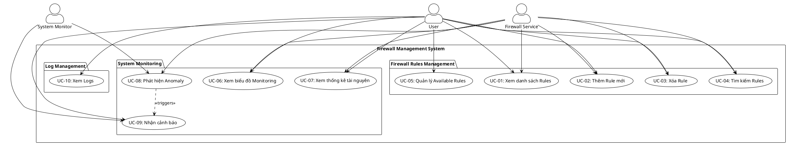
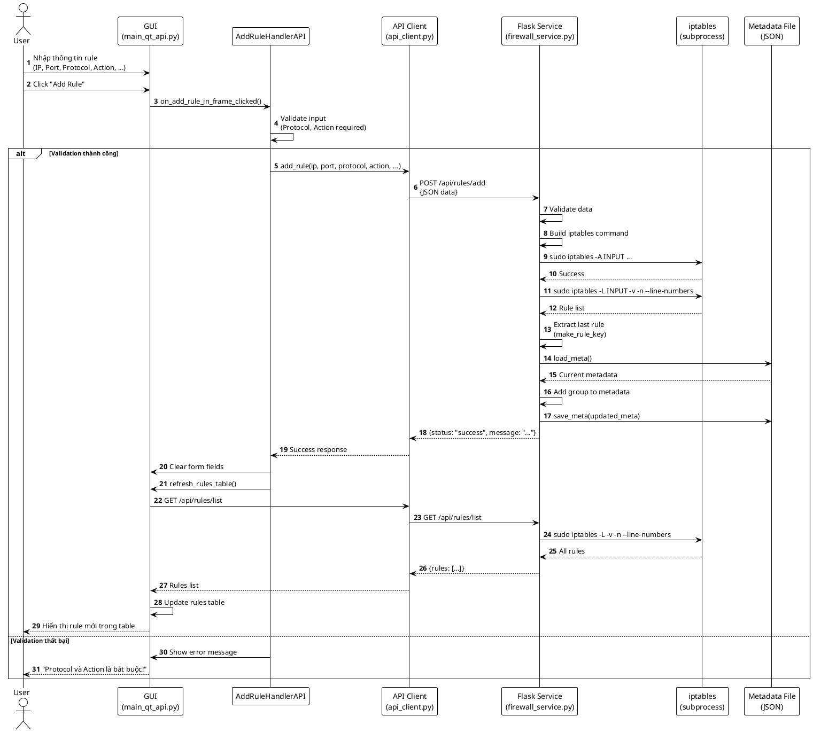
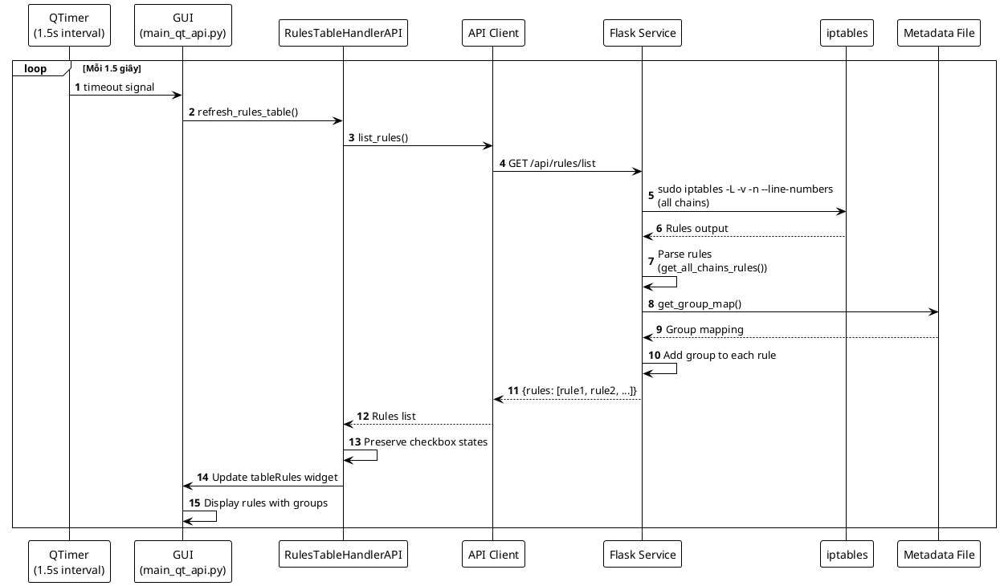
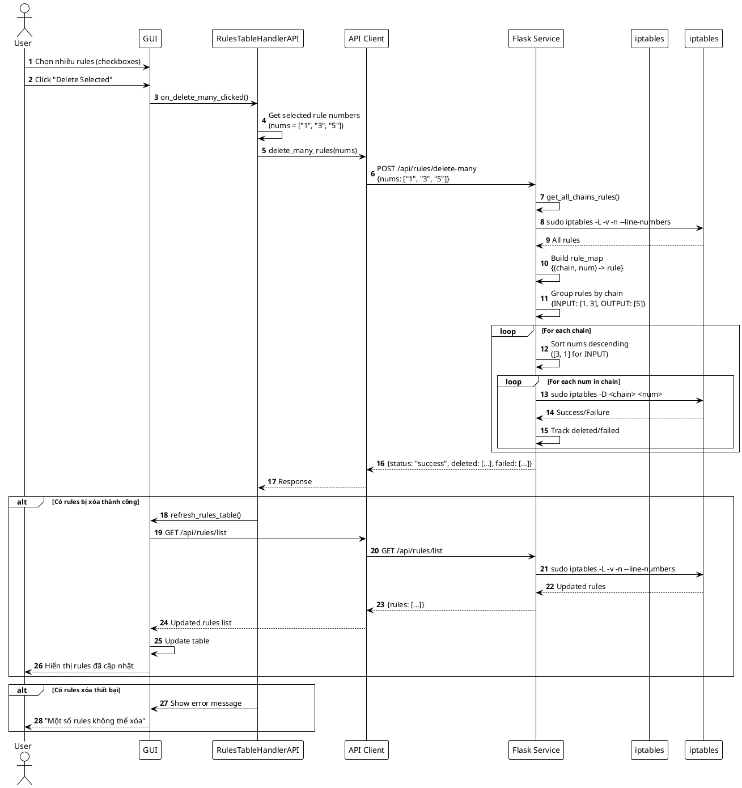
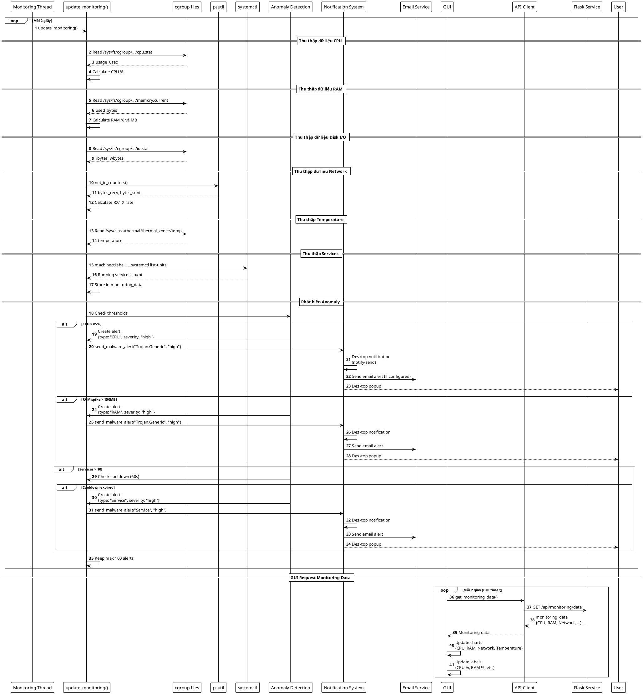
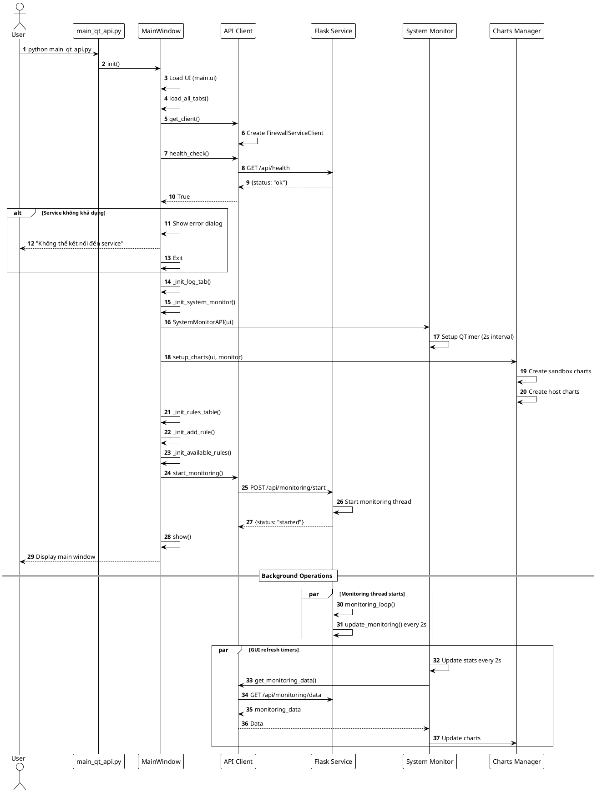
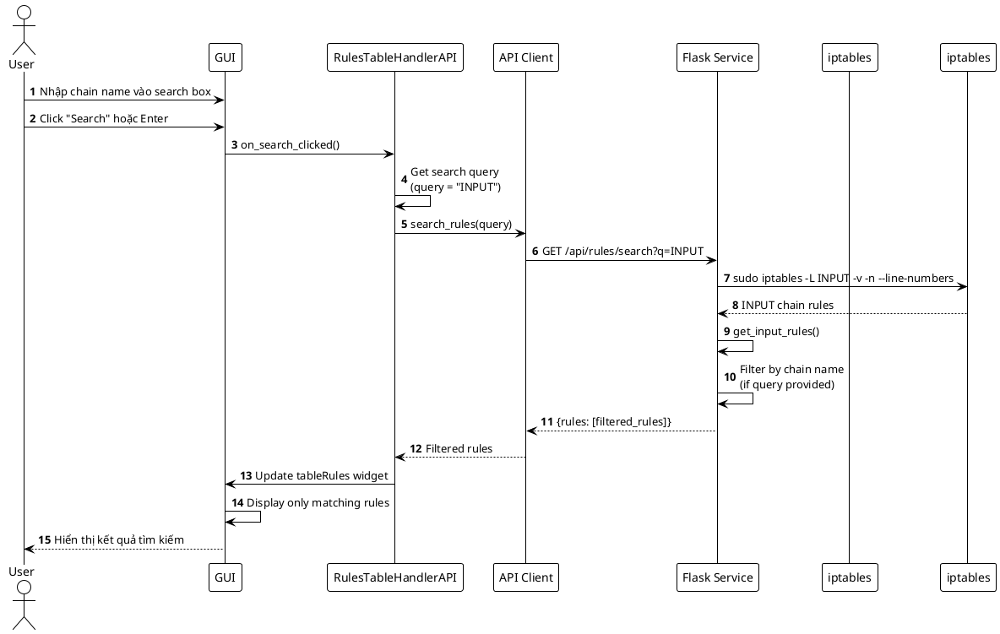

# PHÂN TÍCH USE CASE VÀ SEQUENCE DIAGRAM
## Hệ thống Quản lý Firewall với Giám sát Hệ thống

---

## 1. TỔNG QUAN

Tài liệu này phân tích chi tiết các Use Case và Sequence Diagram của hệ thống quản lý firewall với giám sát hệ thống real-time.

**Kiến trúc hệ thống**: Client-Server
- **Backend**: Flask REST API Service (chạy như systemd daemon)
- **Frontend**: PyQt6 GUI Application

---

## 2. USE CASE DIAGRAM

### 2.1. Tổng quan Use Cases

Hệ thống có các Actor chính:
- **User (Người dùng)**: Sử dụng GUI để quản lý firewall và xem monitoring
- **System Monitor**: Hệ thống tự động giám sát và phát hiện anomaly
- **Firewall Service**: Backend service xử lý logic nghiệp vụ

### 2.2. Danh sách Use Cases

#### 2.2.1. Quản lý Firewall Rules

| Use Case ID | Use Case Name | Mô tả | Actor |
|------------|---------------|-------|-------|
| UC-01 | Xem danh sách Rules | Hiển thị tất cả firewall rules từ các chains | User |
| UC-02 | Thêm Rule mới | Thêm rule mới vào iptables | User |
| UC-03 | Xóa Rule | Xóa một hoặc nhiều rules | User |
| UC-04 | Tìm kiếm Rules | Tìm kiếm rules theo chain name | User |
| UC-05 | Quản lý Available Rules | Enable/disable các rule templates | User |

#### 2.2.2. Giám sát Hệ thống

| Use Case ID | Use Case Name | Mô tả | Actor |
|------------|---------------|-------|-------|
| UC-06 | Xem biểu đồ Monitoring | Hiển thị biểu đồ real-time về CPU, RAM, Network, Temperature | User |
| UC-07 | Xem thống kê tài nguyên | Hiển thị số liệu chi tiết về tài nguyên hệ thống | User |
| UC-08 | Phát hiện Anomaly | Tự động phát hiện CPU spike, RAM spike, service lạ | System Monitor |
| UC-09 | Nhận cảnh báo | Nhận desktop notification và email alert | User |

#### 2.2.3. Quản lý Logs

| Use Case ID | Use Case Name | Mô tả | Actor |
|------------|---------------|-------|-------|
| UC-10 | Xem Logs | Hiển thị logs hệ thống | User |

### 2.3. Use Case Diagram (PlantUML)



---

## 3. SEQUENCE DIAGRAMS

### 3.1. Sequence Diagram: Thêm Firewall Rule (UC-02)

**Mô tả**: User nhập thông tin rule mới qua GUI, hệ thống validate và thêm vào iptables.



### 3.2. Sequence Diagram: Xem danh sách Rules (UC-01)

**Mô tả**: GUI tự động refresh danh sách rules mỗi 1.5 giây.



### 3.3. Sequence Diagram: Xóa nhiều Rules (UC-03)

**Mô tả**: User chọn nhiều rules và xóa cùng lúc, hệ thống xử lý đúng với nhiều chains.



### 3.4. Sequence Diagram: Giám sát Hệ thống và Phát hiện Anomaly (UC-08, UC-09)

**Mô tả**: Hệ thống tự động giám sát tài nguyên và phát hiện anomaly, gửi cảnh báo.



### 3.5. Sequence Diagram: Khởi động hệ thống

**Mô tả**: Luồng khởi động GUI và kết nối với Backend Service.



### 3.6. Sequence Diagram: Tìm kiếm Rules (UC-04)

**Mô tả**: User tìm kiếm rules theo chain name.



---

## 4. CHI TIẾT CÁC USE CASES

### 4.1. UC-01: Xem danh sách Rules

**Preconditions**:
- Firewall Service đang chạy
- GUI đã kết nối thành công với service

**Main Flow**:
1. GUI tự động gọi API `/api/rules/list` mỗi 1.5 giây
2. Service thực thi `iptables -L -v -n --line-numbers` cho tất cả chains
3. Service parse output và thêm group từ metadata
4. Service trả về JSON với danh sách rules
5. GUI cập nhật bảng rules, giữ nguyên trạng thái checkbox

**Postconditions**:
- Bảng rules hiển thị đầy đủ thông tin
- Rules được tự động refresh

**Alternative Flows**:
- Nếu service không khả dụng: Hiển thị lỗi kết nối
- Nếu không có rules: Hiển thị bảng trống

### 4.2. UC-02: Thêm Rule mới

**Preconditions**:
- User có quyền root (service chạy với sudo)
- Protocol và Action đã được nhập

**Main Flow**:
1. User nhập thông tin rule (IP, Port, Protocol, Action, Interface, State, Group)
2. User click "Add Rule"
3. Handler validate input (Protocol và Action bắt buộc)
4. Handler gọi API `/api/rules/add` với JSON data
5. Service build iptables command
6. Service thực thi `iptables -A INPUT ...`
7. Service lấy rule vừa thêm và lưu group vào metadata
8. Service trả về success
9. GUI refresh rules table
10. GUI clear form

**Postconditions**:
- Rule mới được thêm vào iptables
- Metadata được cập nhật
- Rules table được refresh

**Alternative Flows**:
- Validation thất bại: Hiển thị warning "Protocol và Action là bắt buộc!"
- iptables command thất bại: Trả về error message

### 4.3. UC-08: Phát hiện Anomaly

**Preconditions**:
- Monitoring thread đang chạy
- Cgroup files có thể truy cập

**Main Flow**:
1. Monitoring thread gọi `update_monitoring()` mỗi 2 giây
2. Thu thập dữ liệu từ cgroup, psutil, systemctl
3. Kiểm tra các ngưỡng:
   - CPU > 85%
   - RAM spike > 150MB
   - Services > 10 (với cooldown 60s)
4. Nếu phát hiện anomaly:
   - Tạo alert object
   - Gọi `send_malware_alert()`
   - Gửi desktop notification
   - Gửi email (nếu được cấu hình)
5. Lưu alert vào monitoring_data (tối đa 100 alerts)

**Postconditions**:
- Alert được ghi nhận
- User nhận được notification

**Alternative Flows**:
- Cooldown chưa hết: Bỏ qua alert
- Email không được cấu hình: Chỉ gửi desktop notification

---

## 5. TƯƠNG TÁC GIỮA CÁC COMPONENTS

### 5.1. Frontend Components

```
MainWindow (main_qt_api.py)
├── RulesTableHandlerAPI
│   └── API Client
├── AddRuleHandlerAPI
│   └── API Client
├── SystemMonitorAPI
│   └── API Client
├── AvailableRulesHandler
│   └── File I/O (available_rules.json)
└── LogTab
    └── File I/O (logs)
```

### 5.2. Backend Components

```
Flask Service (firewall_service.py)
├── REST API Endpoints
│   ├── /api/health
│   ├── /api/monitoring/*
│   └── /api/rules/*
├── Monitoring Thread
│   └── update_monitoring()
├── Anomaly Detection
│   └── send_malware_alert()
└── iptables Integration
    └── subprocess calls
```

### 5.3. Data Flow

```
GUI Request
    ↓
API Client (HTTP)
    ↓
Flask Service (REST API)
    ↓
Backend Logic (rules/monitoring)
    ↓
System Resources (iptables/cgroup/psutil)
    ↓
Response (JSON)
    ↓
GUI Update
```

---

## 6. CÁC ĐIỂM QUAN TRỌNG TRONG THIẾT KẾ

### 6.1. Separation of Concerns
- **Frontend**: Chỉ xử lý UI và gọi API
- **Backend**: Xử lý logic nghiệp vụ và tương tác với system
- **API Client**: Lớp trung gian để giao tiếp

### 6.2. Asynchronous Operations
- **Monitoring**: Chạy trong thread riêng, không block main thread
- **GUI Refresh**: Sử dụng QTimer để refresh định kỳ
- **Email**: Gửi trong thread riêng để không block

### 6.3. Error Handling
- **Connection Errors**: GUI hiển thị dialog lỗi
- **API Errors**: Trả về error message trong JSON response
- **iptables Errors**: Catch subprocess exceptions

### 6.4. State Management
- **Checkbox States**: Được preserve khi refresh rules table
- **Monitoring Data**: Lưu trong global dictionary
- **Metadata**: Lưu trong JSON file

---

## 7. KẾT LUẬN

Hệ thống được thiết kế theo mô hình Client-Server với các đặc điểm:

1. **Modular Architecture**: Tách biệt rõ ràng giữa frontend và backend
2. **RESTful API**: Giao tiếp qua HTTP/JSON, dễ mở rộng
3. **Real-time Updates**: Monitoring và rules table tự động refresh
4. **Anomaly Detection**: Tự động phát hiện và cảnh báo
5. **Error Resilience**: Xử lý lỗi gracefully, không crash ứng dụng

Các Sequence Diagrams trên mô tả chi tiết luồng xử lý của các use case chính, giúp hiểu rõ cách các components tương tác với nhau.

---

**Ngày tạo**: 2025-01-27  
**Phiên bản**: 1.0  
**Tác giả**: System Analysis

